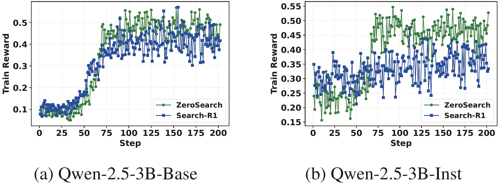

<div align="center">
<p align="center">
  
</p>
</div>

<div align="center">
<h1>ZeroSearch: Incentivize the Search Capability of LLMs without Searching
</h1>
</div>

<div align="center">
<a href='https://huggingface.co/collections/sunhaonlp/zerosearch-681b4ce012b9b6899832f4d0'></a>
<a href='https://huggingface.co/datasets/sunhaonlp/ZeroSearch_dataset'></a>
<a href='https://huggingface.co/collections/sunhaonlp/simulation-llms-681b5177554c8d2d916b7b01'></a>
<a href='https://arxiv.org/pdf/2505.04588'></a><br>
</div>

<p align="center">
  <i><b>Hao Sun, Zile Qiao, Jiayan Guo, Xuanbo Fan, Yingyan Hou</b></i><br>
  <i><b>Yong Jiang, Pengjun Xie, Fei Huang, Yan Zhang</b></i><br>
  <i>Tongyi Lab , Alibaba Group</i>
</p>

# 📌 Introduction

- We propose ZeroSearch, a novel reinforcement learning framework that incentivizes the search capability of LLMs without interacting with real search engines.
- Through supervised fine-tuning, we transform the LLM into a retrieval module capable of generating both relevant and noisy documents in response to a query. We further introduce a curriculum rollout mechanism to progressively elicit the model’s reasoning ability by exposing it to increasingly challenging retrieval scenarios.
- We conduct extensive experiments on both in-domain and out-of-domain datasets. Results show that ZeroSearch outperforms real search engine-based models while incurring zero API cost. Moreover, it generalizes well across both base and instruction-tuned LLMs of various sizes and supports different reinforcement learning algorithms.

# 🛠 Dependencies

```bash
conda create -n zerosearch python=3.9
conda activate zerosearch
pip install torch==2.4.0 --index-url https://download.pytorch.org/whl/cu121
pip install vllm==0.6.3
pip install wandb
pip install serpapi

# verl
pip install -e .

# flash attention 2
pip3 install flash-attn --no-build-isolation

# sglang
pip install sglang[all]==0.4.4.post3
```


# 📖 Quick Start
(1) Download the training dataset.

```bash
huggingface-cli download --repo-type dataset --resume-download sunhaonlp/ZeroSearch_dataset --local-dir ZeroSearch_dataset
```

(2) Download the simulation LLMs.

```bash
# There are different parameter sizes, please choose based on your needs.
huggingface-cli download --resume-download sunhaonlp/SearchSimulation_3B --local-dir SearchSimulation_3B

huggingface-cli download --resume-download sunhaonlp/SearchSimulation_7B --local-dir SearchSimulation_7B

huggingface-cli download --resume-download sunhaonlp/SearchSimulation_14B --local-dir SearchSimulation_14B
```

(3) Launch a local simulation server.

```bash
# Prompt-based simulation
python -m sglang.launch_server --model-path Qwen2.5-14B-Instruct --host 0.0.0.0 --tp 2 --dp 2 --port 6001

# Fine-tuning-based simulation
python -m sglang.launch_server --model-path SearchSimulation_14B --host 0.0.0.0 --tp 2 --dp 2 --port 6001
```

(4) Conduct RL training with Llama-3.2-3B.

```bash
# Activate the Conda environment
conda activate zerosearch

# Set your Google Search API key
export SER_API_KEY=your_api_key

# You can run GRPO or PPO training using the scripts below. GRPO is recommended due to its greater training stability.
# The START_THRESHOLD and END_THRESHOLD parameters define the initial and final difficulty levels of the training tasks. Adjusting these values can help optimize model performance.

## Prompt-based simulation
bash train_grpo.sh NUM_GPUS_PER_NODE 4 MODEL_PATH Llama-3.2-3B DATA_PATH ZeroSearch_dataset TOTAL_STEPS 203 IP localhost SEARCH_MODE simulate_prompt SIMULATION_LLM Qwen2.5-14B-Instruct START_THRESHOLD 0.25 END_THRESHOLD 0.5
bash train_ppo.sh NUM_GPUS_PER_NODE 4 MODEL_PATH Llama-3.2-3B DATA_PATH ZeroSearch_dataset TOTAL_STEPS 203 IP localhost SEARCH_MODE simulate_prompt SIMULATION_LLM Qwen2.5-14B-Instruct START_THRESHOLD 0.25 END_THRESHOLD 0.5

## Fine-tuning-based simulation
bash train_grpo.sh NUM_GPUS_PER_NODE 4 MODEL_PATH Llama-3.2-3B DATA_PATH ZeroSearch_dataset TOTAL_STEPS 203 IP localhost SEARCH_MODE simulate_sft SIMULATION_LLM SearchSimulation_14B START_THRESHOLD 0.25 END_THRESHOLD 0.5
bash train_ppo.sh NUM_GPUS_PER_NODE 4 MODEL_PATH Llama-3.2-3B DATA_PATH ZeroSearch_dataset TOTAL_STEPS 203 IP localhost SEARCH_MODE simulate_sft SIMULATION_LLM SearchSimulation_14B START_THRESHOLD 0.25 END_THRESHOLD 0.5
```

# 💡 Performance

### 📊 Main Results

<div align="center">
    
</div>

### 📊 Compare ZeroSearch with Real Search Engine 

<div align="center">
    
</div>

### 📊 Choice of Simulation LLMs

<div align="center">
    
</div>

### 📊 Case Study

<div align="center">
    
</div>


# 🙏 Acknowledgements

This work is implemented based on [Search-R1](https://github.com/PeterGriffinJin/Search-R1), [veRL](https://github.com/volcengine/verl), and [RAGEN](https://github.com/ZihanWang314/RAGEN/tree/main). We sincerely thank the authors of these projects for their valuable contributions to the open-source community.

## 🚩Citation

If this work is helpful, please kindly cite as:

```bigquery
@misc{sun2025zerosearchincentivizesearchcapability,
      title={ZeroSearch: Incentivize the Search Capability of LLMs without Searching}, 
      author={Hao Sun and Zile Qiao and Jiayan Guo and Xuanbo Fan and Yingyan Hou and Yong Jiang and Pengjun Xie and Fei Huang and Yan Zhang},
      year={2025},
      eprint={2505.04588},
      archivePrefix={arXiv},
      primaryClass={cs.CL},
      url={https://arxiv.org/abs/2505.04588}, 
}
```
